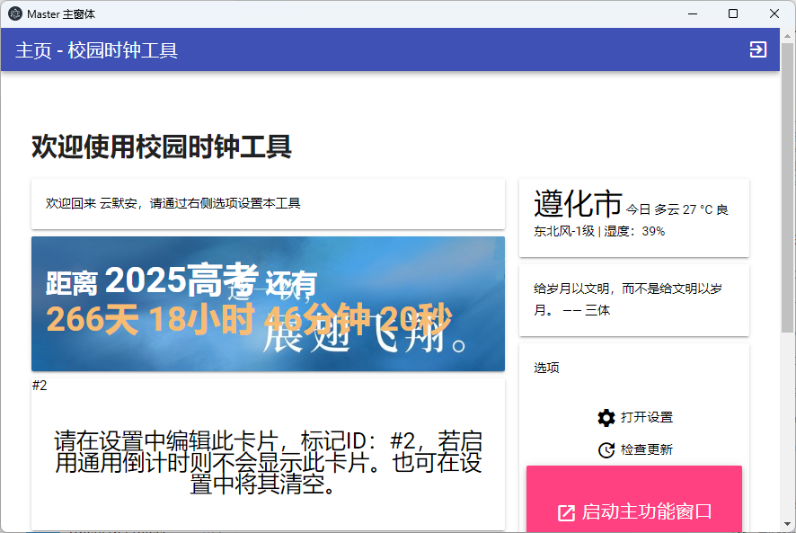
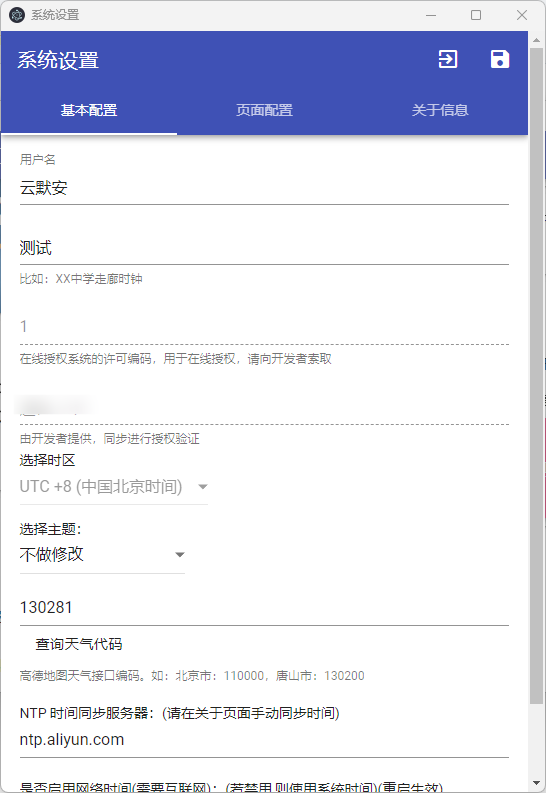
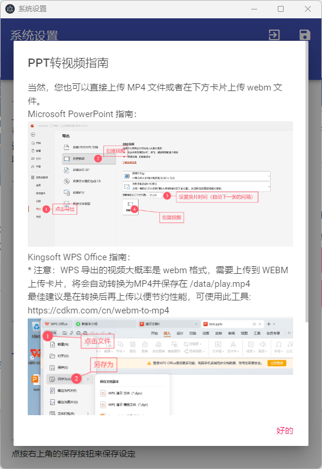

# school-clock 校园时钟

一个基于 Electron 的展示用综合信息工具
***
## 预览





***
## 功能

当前已实现：
- [x] 自动年份的高考倒计时
- [x] 访问 hitokoto 一言 API
- [x] 本地系统时钟
- [x] 手动/自动与 NTP 服务器同步时间
- [x] 基于视频的演示功能（mp4或webm）（可调节音量）
- [x] 自定义背景图片
- [x] 上下滚动字幕
- [x] 文本卡片（支持HTML标签）
- [x] 通用倒计时组件
- [x] 天气组件
- [x] 视频播放器
- [x] 低分辨率支持
- [x] 暗黑模式（与系统同步）
- [x] 支持主题开发

以下功能开发中：
- [ ] 自动更新
- [ ] 动态渲染背景
- [ ] 更多自定义功能
- [ ] 主题系统

欢迎大佬参与开发
***
## 已知问题
- 在结束应用时有时会莫名其妙重新打开主窗口，再次退出即可结束进程
- 没有做任何配置文件格式校验，错误的配置文件可能导致错误
- 初始化没有禁止空文本框提交，有可能会导致配置文件错误（如果没有问题，一般是空）

更多问题欢迎提交 issue
***
## 依赖
需要在启动前配置好 nodejs 并使用命令 ```npm install``` 安装依赖

一并需要安装 electron

开发环境：Windows 11 / Node.js v20.12.2

***
## 调试
命令：```npm run start```

通过此命令即可启用 electron 并使用调试模式，此时会在控制台输出调试信息

***
## 构建

命令：```npm run build```

构建完成后，会在 dist 目录下生成一个可执行文件

构建的版本号需要在 package.json 和 core 目录下的 versionConfig.json 中修改

本仓库同时提供我们的构建，可在 Release 页面下载

***
## 数据目录
应用程式所有的数据都将保存在
```shell
C:\Users\{username}\AppData\Roaming\school-clock\data
```
此处存放了配置文件、背景图片等数据，也可以将其复制以迁移到其他设备

***
## 协议

此应用程式基于 GNU GPL-3.0 协议发布并开源，有关详细协议内容请参考 LICENSE 文件

以下是 GNU GPL-3.0 协议的简述：

**你不能：**

- 将本软件或其修改版本以非 GPL-3.0 许可证发布。
- 添加额外的限制，阻碍他人行使 GPL-3.0 授予的权利。
- 在未提供源代码的情况下分发本软件的修改版本。

**你可以：**

- 出于任何目的自由运行本软件。
- 获取源代码并根据需要进行研究和修改。
- 复制和分发本软件的原始版本或你修改后的版本，但需遵守 GPL-3.0 的条款。
- 将你的修改版本或衍生作品以相同的许可证发布，确保软件的自由和开源性。

GNU GPL-3.0 协议旨在保护软件的自由性，任何人不得二次商用发布。

***
本软件部分内容使用了 ChatGPT 4/4o/o1 等模型辅助开发。
